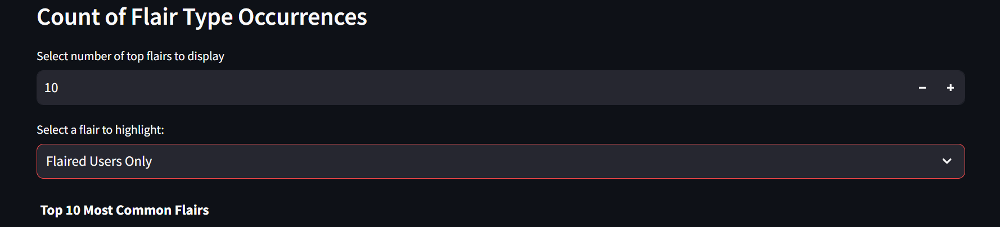
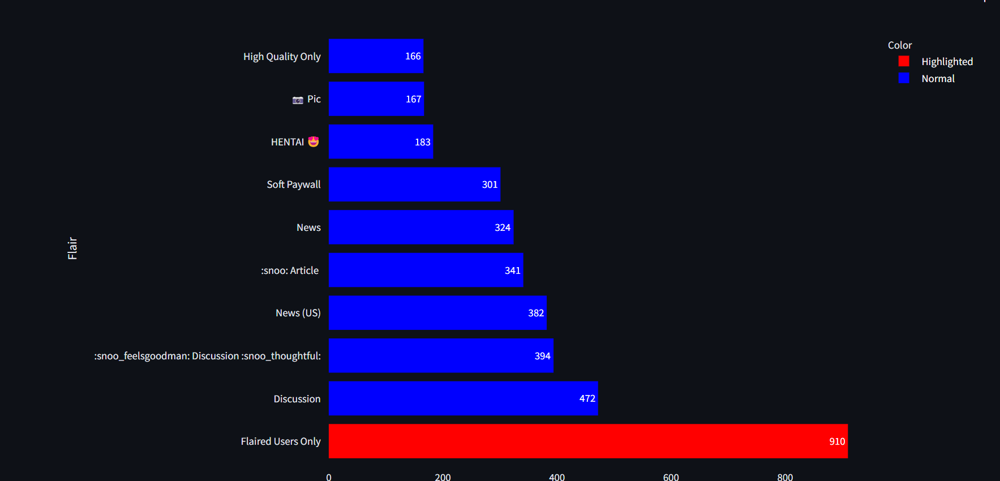
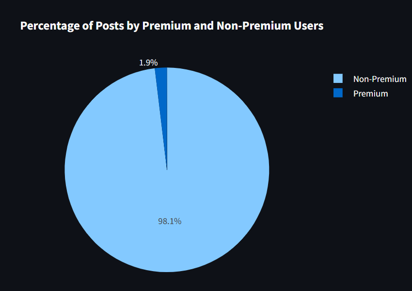
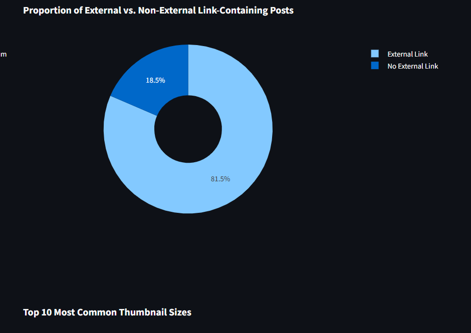
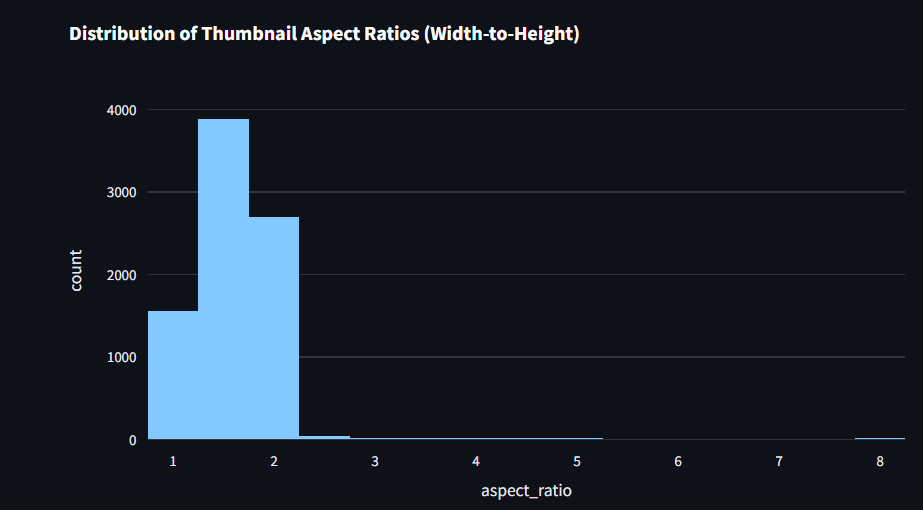
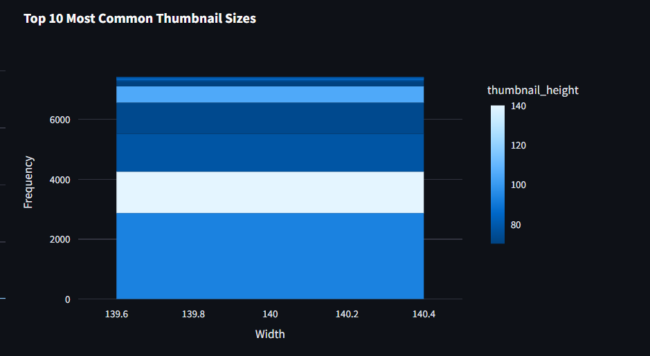
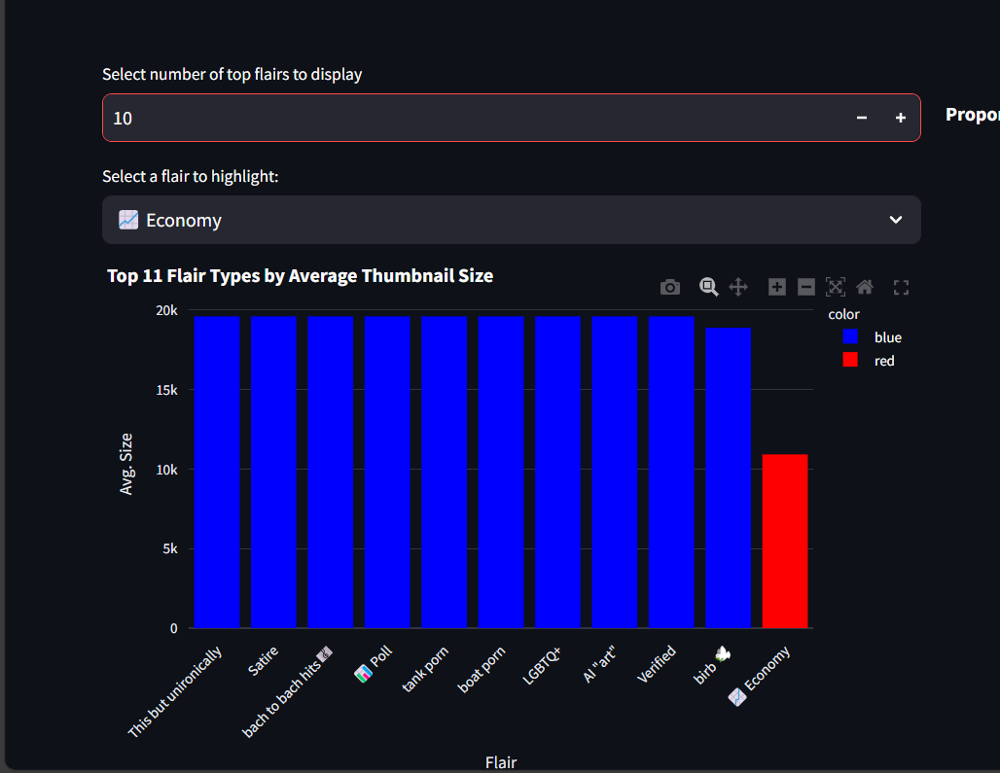
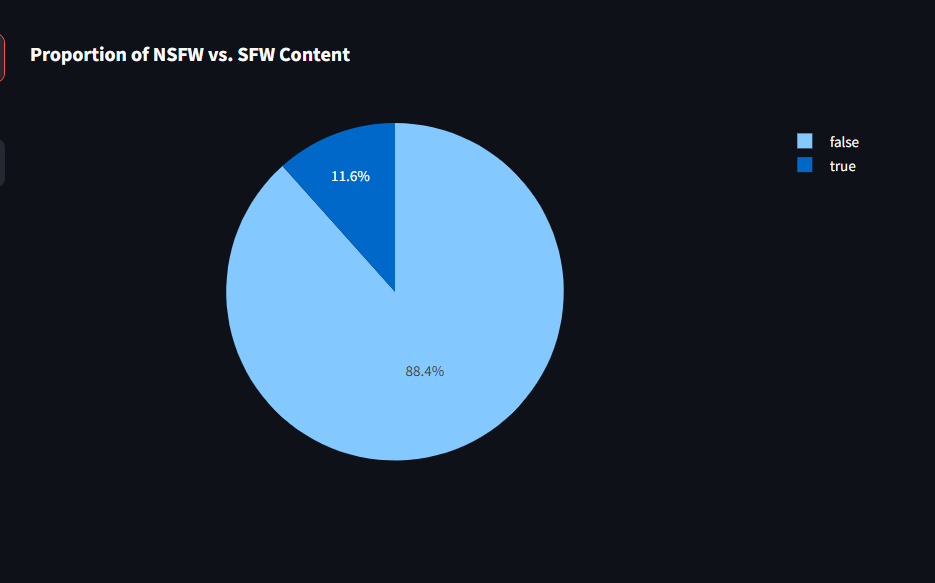
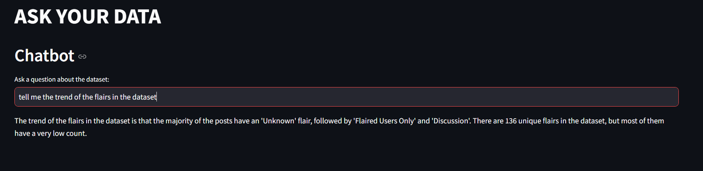

# **Reddit Data Dashboard & Chatbot**

This project presents an **interactive dashboard** and an **AI-powered chatbot** built using **Streamlit**, which helps users explore and analyze a cleaned dataset of Reddit posts. The dashboard offers insightful **visualizations** and **filters**, while the chatbot allows users to query information about the dataset dynamically.

## **Dataset Overview**
The cleaned dataset (after preprocessing) consists of **8,205 Reddit posts** with key attributes such as:
- **Post Flair** (`link_flair_text`): Categorization of the post.
- **Thumbnail Dimensions** (`thumbnail_width`, `thumbnail_height`): Image metadata.
- **Post Type** (`post_hint`): Whether the post is a link, image, or text.
- **Content URL** (`url_overridden_by_dest`): External link (if available).
- **Maturity Rating** (`over_18`): Indicates if the post is NSFW.
- **Author Information** (`author_premium`, `author_fullname`): Metadata about the post creator.
- **Media Type** (`media_only`): Whether the post contains only media.

## **Key Features**
- 📊 **Dashboard:** Displays interactive visualizations of Reddit data trends.
- 🤖 **Chatbot:** Allows users to ask questions about the dataset.

---

## **Key Insights**

### **1. Flair Analysis**
#### **Count of Flair Type Occurrences**
This feature displays the **top 10 most occurring flair types** from the posts in the database.
- Flair counts are determined using `value_counts()` on the `link_flair_text` column.
- Users can **adjust the number of top flairs** displayed using a numeric input field.
- A dropdown allows users to **highlight a specific flair** and view its exact contribution.

  
  

---

### **2. Percentage of Posts by Premium and Non-Premium Users**
This feature visualizes the percentage of Reddit posts created by **premium** users vs **non-premium** users.

- **Premium Users:** Posts created by users with a premium subscription.
- **Non-Premium Users:** Posts created by users without a premium subscription.

The dashboard visualizes this data through a **pie chart**, making it easy for users to understand the proportion of content contributed by premium vs non-premium users.

  

---

### **3. Proportion of External vs Non-External Link Containing Posts**
This feature visualizes the proportion of posts that contain **external links** versus those that do not.

- **External Link Posts:** Posts that contain a URL linking to an external website (`url_overridden_by_dest` is not null).
- **Non-External Link Posts:** Posts that do not contain an external link.

The dashboard represents this data using a **pie chart**, providing a clear comparison between posts with and without external links.

  

---

### **4. Distribution of Thumbnail Aspect Ratios (Width-to-Height)**
This histogram visualizes the **distribution of aspect ratios** for thumbnails in the dataset.

#### **Key Details**
- The **x-axis** represents the **aspect ratio** (width divided by height).
- The **y-axis** represents the **frequency** of posts with that aspect ratio.
- Most thumbnails have an aspect ratio between **1 and 2**, with a significant peak around **1.5**.
- There are a few outliers with aspect ratios as high as **8**.

This analysis helps understand **how thumbnails are structured** across Reddit posts and whether certain aspect ratios dominate the platform.

  

---

### **5. Top 10 Most Common Thumbnail Sizes**
This feature visualizes the **most frequent thumbnail sizes** in the dataset.

- The **x-axis** represents the **width** of the thumbnails.
- The **y-axis** represents the **frequency** of occurrences for each width.
- The **color gradient** represents the corresponding **thumbnail heights**, providing an additional layer of insight.

This visualization helps identify the most commonly used thumbnail dimensions in Reddit posts.

  

---

### **6. Dynamic Flair Selection and Highlighting**
This visualization allows users to explore the **top flairs ranked by average thumbnail size** with two key interactive features:

#### **Features**
1. **Adjustable Number of Flairs**
   - Users can **increase or decrease** the number of top flairs displayed using the input field.
   - The chart dynamically updates to reflect the selected number.

2. **Flair Highlighting**
   - Users can **select a specific flair** from the dropdown menu.
   - The selected flair is **highlighted in red**, making it stand out from the others.

#### **Visualization Details**
- The **x-axis** represents different **flair types**.
- The **y-axis** shows the **average thumbnail size** for each flair.
- **Blue bars** represent the default flairs.
- **The selected flair appears in red for easy identification**.
- A **tooltip** appears on hover, showing details like:
  - **Flair name**
  - **Average thumbnail size**

  

---

### **7. Proportion of NSFW vs. SFW Content**
This pie chart provides a **visual representation of the proportion of NSFW (Not Safe For Work) vs. SFW (Safe For Work) content**.

#### **Understanding the Chart**
- The **light blue section** represents **SFW content**.
- The **dark blue section** represents **NSFW content**.
- The **percentage values** inside the chart indicate the exact distribution.

#### **Key Insights**
- **88.4% of the content is SFW**, meaning it is safe for general viewing.
- **11.6% of the content is NSFW**, which may contain explicit material.

#### **Legend**
- **false** (light blue) → SFW content  
- **true** (dark blue) → NSFW content  

This visualization helps understand the **balance between safe and explicit content**, allowing users to analyze the distribution effectively.

  

---

### **8. Chatbot Dataset Query**
This feature allows users to ask questions about the dataset and receive instant insights. The chatbot processes user queries and returns relevant trends, distributions, and summaries based on the dataset.

#### **Functionality**
- Users can type natural language questions related to the dataset.
- The chatbot analyzes the dataset and generates a concise response.
- Responses include key insights, trends, and statistical distributions.

#### **Example**
**User Query:**  
> Tell me the trend of the flairs in the dataset.

**Chatbot Response:**  
The trend of the flairs in the dataset is that the majority of the posts have an 'Unknown' flair, followed by 'Flaired Users Only' and 'Discussion'. There are 136 unique flairs in the dataset, but most of them have a very low count.

  

---

## 🗂 1. Data Handling & Preprocessing  

### 🔹 Why Pandas?  
- **Efficient Data Handling**: The dataset contains **8,205 Reddit posts** after preprocessing, making **pandas** an ideal choice for **loading, filtering, and aggregating** data.  
- **Data Cleaning**: Unnecessary columns are dropped, missing values are handled, and categorical values are processed for effective visualization.  

### 📊 Final Processed Dataset Overview  

| **Feature** | **Description** |
|------------|----------------|
| **Post Flair (`link_flair_text`)** | Categorization of the post. |
| **Thumbnail Dimensions (`thumbnail_width`, `thumbnail_height`)** | Image metadata of the post. |
| **Post Type (`post_hint`)** | Indicates whether the post is a link, image, or text. |
| **Content URL (`url_overridden_by_dest`)** | External link associated with the post (if available). |
| **Maturity Rating (`over_18`)** | Whether the post is NSFW (Not Safe For Work). |
| **Author Information (`author_premium`, `author_fullname`)** | Metadata about the post creator. |
| **Media Type (`media_only`)** | Specifies if the post contains only media. |

---

## 📊 2. Dashboard Visualization (Streamlit + Plotly)  

### 🔹 Why Streamlit?  
- **Lightweight and Interactive**: No need for complex web frameworks.  
- **Supports Real-time Updates**: Widgets like sliders and dropdowns allow users to dynamically adjust filters.  
- **Easier Deployment**: Can be hosted quickly on platforms like Streamlit Cloud.  

### 🔹 Why Plotly?  
- **Interactive Graphs**: Users can hover over, zoom in, and select data points dynamically.  
- **Supports Multiple Chart Types**: Bar charts, pie charts, and scatter plots help explore various data trends.  

### 📈 Graph Selection & Thought Process  

| **Feature** | **Graph Type** | **Why this choice?** |
|------------|--------------|----------------|
| **Flair Analysis** | Bar Chart | Helps visualize the **top 10 most used flairs**, making it easy to see content distribution. |
| **Premium vs Non-Premium Posts** | Pie Chart | Clearly represents the **percentage of posts** contributed by premium users. |
| **External vs Non-External Links** | Pie Chart | Allows quick comparison of posts containing **external links vs. internal posts**. |
| **Thumbnail Size Distribution** | Scatter Plot | Showcases the most **common thumbnail dimensions**, helping understand Reddit’s media trends. |
| **NSFW vs SFW Content** | Pie Chart | Quickly highlights the proportion of **safe vs. explicit content**, which is a key concern for Reddit users. |
| **Distribution of Thumbnail Aspect Ratio** | Histogram | Helps visualize the distribution of **width-to-height ratios**, identifying common media aspect ratios. |
| **Top N Flair Types by Avg. Thumbnail Size** | Bar Chart | Displays which flairs have the **largest average thumbnail size**, providing insights into post media trends. |

---

## 🤖 3. AI Chatbot Integration (LangChain + Groq)  

### 🔹 Why LangChain?  
- Allows users to **query the dataset using natural language** instead of manual filtering.  
- Uses **LLMs (Large Language Models) from Groq** to generate intelligent responses.  
- The `create_csv_agent` function enables direct **data-driven responses** based on CSV analysis.  

### 🔍 How the Chatbot Works  
1. **User inputs a question** (e.g., “What is the trend of flairs in the dataset?”).  
2. **LangChain CSV Agent** processes the request and extracts relevant information from the dataset.  
3. **Groq’s LLM** formulates a human-readable response with insights from the data.  
4. **Output is displayed** within the Streamlit app.  

---

## 🏗 4. System Architecture  

### 🛠 Overall Flow:  
1. **Data Ingestion** → Load CSV with pandas.  
2. **Data Processing** → Filter, clean, and prepare data for visualization.  
3. **Visualization Layer** → Streamlit + Plotly for an interactive UI.  
4. **AI Chatbot** → LangChain + Groq for dataset querying.  
5. **Deployment** → Hosted using Streamlit Cloud.  

---

## **Live Demo**
🌐 **[Access the Dashboard Here](https://hetchaudhari123-research-engineering-intern-as-dashboard-vlc8yk.streamlit.app/)**  
